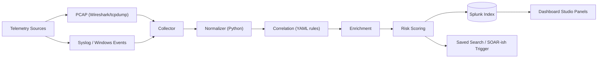

```mermaid
flowchart LR
A["Telemetry Sources"]
P["PCAP (Wireshark/tcpdump)"]
S["Syslog / Windows Events"]
B["Collector"]
C["Normalizer (Python)"]
D["Correlation (YAML rules)"]
E["Enrichment"]
F["Risk Scoring"]
H[("Splunk Index")]
J["Dashboard Studio Panels"]
K["Saved Search / SOAR-ish Trigger"]

A --> P
A --> S
P --> B
S --> B
B --> C
C --> D
D --> E
E --> F
F --> H
H --> J
F --> K
```
